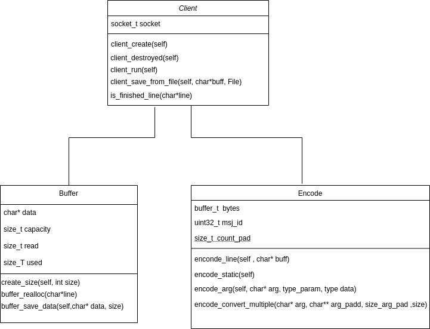
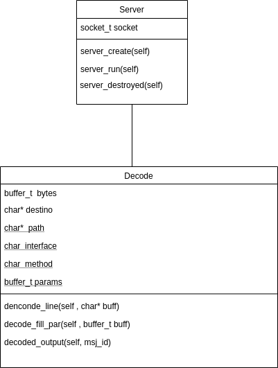

# tp1

* Nombre y apellido: Agostina Vásquez
* Padrón: 99689
* Link al repositorio: https://github.com/agosvasquez/tp1

La resolución del tp se desarollo con el siguiente enfoque: 

* Service: este tiene un socket y su responsabilidad es comunicarse con el client, recibir lo que este manda decodificarlo y mandar una respuesta y hacer su output correspondiente. 

* Client : este tambien consta de un socket con el cual se comunica con el servidor, lee los parametros de entrada los codifica y los envia, luego devuelve el output correspondiente.

* Encode: el encode se encarga de codificar una tira de strings a su formato d_bus.

* Decode: se encarga de de decodificar una tira de bytes en formato d_bus. 

* Buffer: es una estructura dinamica que guarda los datos. Su responsabilidad es saber su capacidad, cuanto se leyo, y el uso de datos del mismo.

* Socket : El socket se encarga de realizar el envio de datos en un formato a traves de la red hacia otro socket.

 
  .

 

